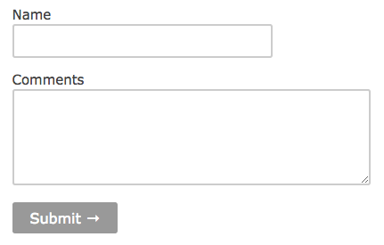

# form.css
Simple, standard, opinionated CSS for forms

## Developing

1. Make sure you have Sass and Node.js installed.
2. Make sure to run `npm i` first
3. Run `grunt watch` for continuous building.

## [Example](./example/index.html)
